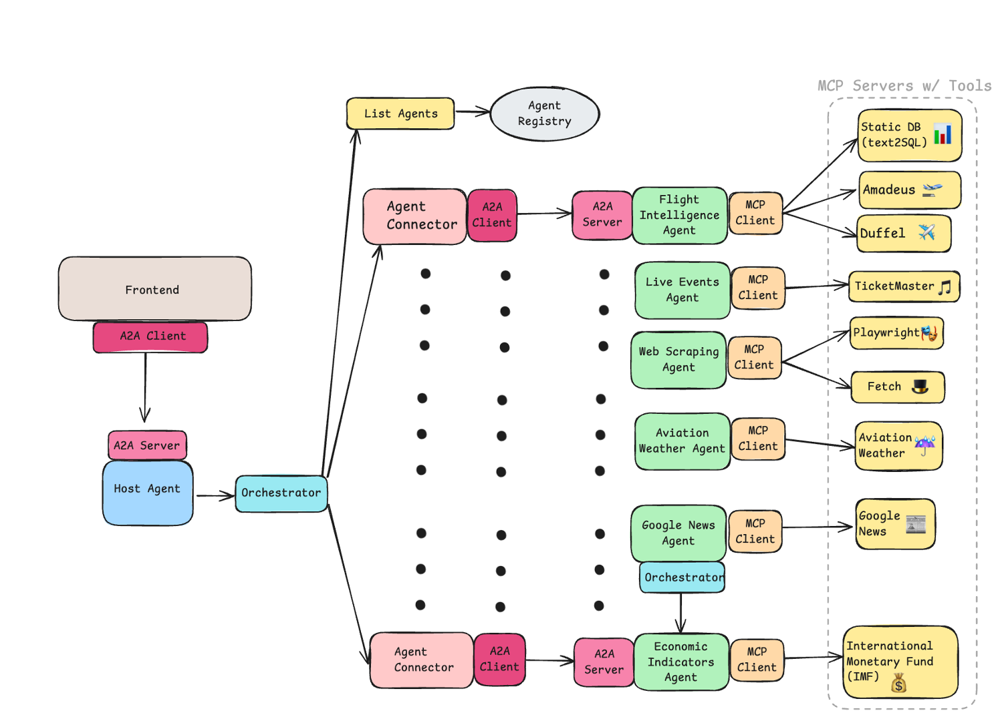
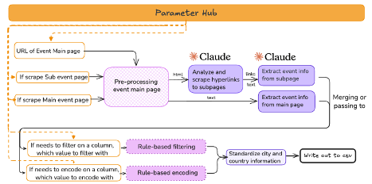
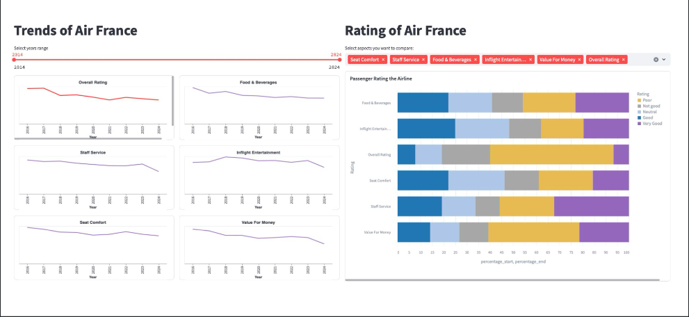
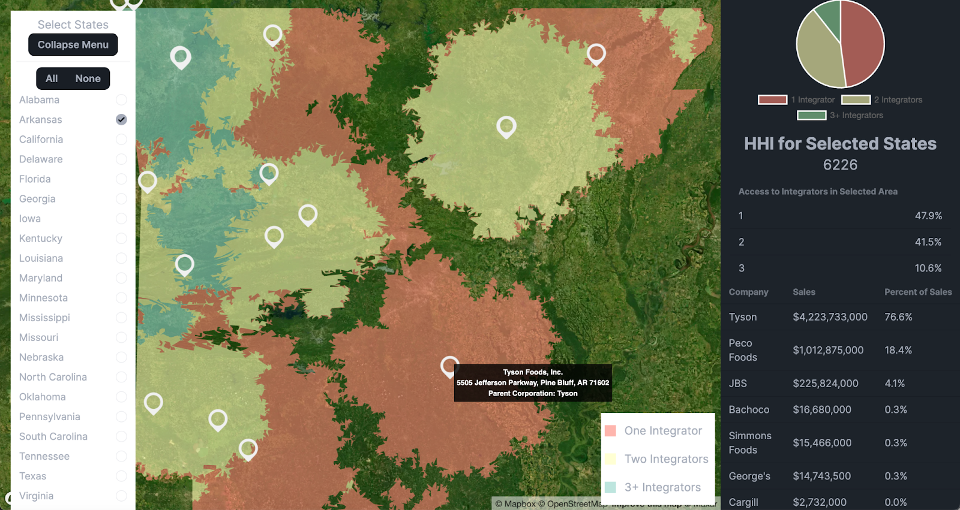

# Data Projects Portfolio

## AI Product

#### Multi-Orchestrated System for Airline Intelligence & Coordination (MOSAIC)
*June 2025*

Team: Ariel Azria, Linda Ji, Daniel Sa, Ishwar Ramesh, Dev Patel

My role: Developer working on text2sql agent and Static data MCP server

  

To enhance internal demand forecasting, our team built an **AI-powered analytics dashboard** that integrates and visualizes key external signals—including weather, news, and social media trends to explain past demand and predict future demand. Our team won the first place of Generative AI Hackathon hosted by United Airline and University of Chicago. 

We leveraged **Agent-to-agent** framework to create a Multi-Agent tool with an Orchestrater connecting to a range of agents. Each agent is connected to 1-2 **MCP server**, while each server hosted different data sources, including historical/forecasted weather, historical/forcasted flight price, past/future events, Google Trends, Google News, aviation weather and IMF insights, and necessary tools to retrieve all data. For historical data, we created a **text-to-sql agent** under **LangGraph** framework to convert natural language query to SQL command and retrieves data via **Retrival-Augmented-Generation (RAG)** structure. The front end was developed with **React.js**. 

#### AI Scraper for Global Calendar of Statistical Events
*March 2025 - Present*

Supervisor: Alexander Loschky

Client: United Nations Statistics Division

My role: Data Science Intern

  

The [Global Calendar of Statistical Events](https://unstats.un.org/capacity-development/calendar/all-events/) is a data hub that highlights the capacity-building events related to statistics and geospatial information. For compiling the event data from 50+ sources the Global Calendar relies on 30+ traditional web scraping bots and some manual data collection. The web scraping bots need to be updated regularly to adjust for changes on the source websites and manual data collection is very time consuming. 

The [AI Scraper](https://www.youtube.com/watch?v=IK9c7qVP584&list=PLz85tuGs6Qzh39ppFdMQYWnMNY1TrJpaP) was developed to deal with unstructured data and varied website layouts. By introducing a technical pipeline including pre-processing, AI extracting events and post-processing, the AI Scraper tremendously reduced the time of scraping and attains 95% accuracy, ensured by human verification. To improve accuracy and lower down hallucination, I used **Chain-of-thought (COT)** to effectively do **prompt-engineering**. 
 

#### MatchaPanda: A Job Match AI Assistant
*March 2025 - Present*

Team: Adam Sannes, Anthony Wu

My role: Data Scientist building RAG framework and Agent

Job search can be tedious for students for 2 reasons: the fragmentation of job listings and bulky text of job descriptions. It is very hard to scale up and speed up the process of identifying jobs that matches one's profile. Our team developed a Job Match Assistant which takes users' resume, analyzes its similarity with a list of job descriptions, and picks the top 3 matches with clarified reason. 

This product combines AI agent and MCP server to achive the perfect match. The agent will request data from MCP server, which is connected to [Adzuna](https://www.adzuna.com/), a global job search engine and aggregator that collects job listings from various sources via API. The front end was developed with **React.js** 

#### Airconnect: Flight Agent Q&A bot 
*March 2024 - May 2024*

Team: Natalia Elezovic, Peter Pezon

My role: Student Data Scientist building information dashboard, scraping policy data and building tools for agent. 

  

In the fast-paced world of air travel, passengers are bombarded with choices—from flight options to amenities and pricing. Comparing airlines and their products is time-consuming! To solve this problem, we create a chatbot that can answer related questions. We leveraged 2 datasets: SkyTrax (check) customer reviews and 13 airlines policy data scraped from official websites. This application streamlines users flightcomparison process for, harnessing the power of LLMs. This application also has a portal to collect user sentiments, which provides a tool for businesses to analyze customer feedback. 

The technical highlight of this product is to create knowledge graph for airline policies. The policy data was first stored and built index for graph creation. The Graph Agent (sure?) will retrieve relationships and nodes via Query Engine based on users query. Airline reviews and ratings were stored in Pinecone database. The agent is tool-based, being able to use query engines to retrieve reviews and policies, create plots of ratings, and summarize the result to users. 

#### Spatial Dashboard Visualizing Livestock Market Concentration
*Jan 2024 - March 2024*

Team: Colin McLuckie, Stella Chen, Aiwen Xiao

My role: Student Data Scientist working on rule-based filtering

Client: Rural Advancement Foundation International (RAFI)
[Presentation link](https://www.youtube.com/watch?v=ruTbR7Wl1SQ&t=77s)

  

###### Poultry Market Capture Dashboard
Our dashbaord visualized the spatial concentration of poultry farms in United States. Starting from sampling from North Carolina, our team improved an existing **Computer Vision** model that identifies poultry barns from aerial photography. The team excluded barns located in airports, coastal regions, and major city centers, and removed about **10% (around 2000 barns)** of predictions as false positives by implementing **rule-based filtering** and leveraging **Google Earth Engine**. 

###### Livestock Auction House Dashboard
We built a spatial and time-series dashboard to visualizing market trend of livestock auction house. With a merged dataset of 3400+ auction houses, we explored the revenue, count, geospatial, and flux trends across US from 1991 to 2021. 

#### Developing Equity Indicators for Illinois State Government Agency
*Jan 2024 - March 2024*
My role: Student Data Scientist
Client: Illinois State Government Agency

To achieve equity in accessing Unemployment Insurance (UI) benefits, our team developed an **equity indicator** to serve as a metrics to assess disparities in accessing UI. We leveraged data from a pilot quarter, investigated and combined 4 key datasets. We summarized important data caveats to offer client gain a thorough understanding about the data source they have, and conducted sectoral analysis, including industry, county, company size, union and wage quantile. Our approach helps our client to allocate targeted resources to enhance information support for underrepresented applicants. 
